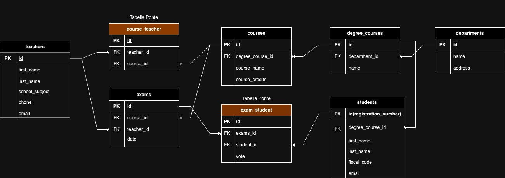

## nome repo: db-university
Modellizzare la struttura di un database per memorizzare tutti i dati riguardanti una università:
- sono presenti diversi Dipartimenti (es.: Lettere e Filosofia, Matematica, Ingegneria ecc.);
- ogni Dipartimento offre più Corsi di Laurea (es.: Civiltà e Letterature Classiche, Informatica, Ingegneria Elettronica ecc..)
- ogni Corso di Laurea prevede diversi Corsi (es.: Letteratura Latina, Sistemi Operativi 1, Analisi Matematica 2 ecc.);
- ogni Corso può essere tenuto da diversi Insegnanti;
- ogni Corso prevede più appelli d’Esame;
- ogni Studente è iscritto ad un solo Corso di Laurea;
- ogni Studente può iscriversi a più appelli di Esame;
- per ogni appello d’Esame a cui lo Studente ha partecipato, è necessario memorizzare il voto ottenuto, anche se non sufficiente.
Pensiamo a quali entità (tabelle) creare per il nostro database e cerchiamo poi di stabilirne le relazioni.
Infine, andiamo a definire le colonne e i tipi di dato di ogni tabella.
Esportare il diagramma in jpg e caricarlo nella repo.

## Diagramma

---

### Esercizio di oggi: DB University - Queries
### nome repo: db-university (stessa di ieri)
Dopo aver creato un nuovo database nel vostro phpMyAdmin importando il file in allegato, eseguite le query che trovate nei PDF, partendo da EX con Select per poi passare a quelle con GROUP.
Cosa  e come consegnare?
Dopo aver testato le vostre query con phpMyAdmin, riportatele in un file .sql e caricatelo nella vostra repo.
Sarebbe consigliabile effettuare un push ad ogni query completata.

<!-- 1. Selezionare tutti gli studenti nati nel 1990 (160) -->
SELECT * FROM `students` WHERE YEAR(`date_of_birth`) = 1990;

<!-- 2. Selezionare tutti i corsi che valgono più di 10 crediti (479) -->
SELECT * FROM `courses` WHERE `cfu` > 10;

<!-- 3. Selezionare tutti gli studenti che hanno più di 30 anni -->
SELECT * FROM `students` WHERE YEAR(`date_of_birth`) > '1994';

<!-- 4. Selezionare tutti i corsi del primo semestre del primo anno di un qualsiasi corso di laurea (286) -->
SELECT * FROM `courses` WHERE `year`='1' AND `period`='I semestre';

<!-- 5. Selezionare tutti gli appelli d'esame che avvengono nel pomeriggio (dopo le 14) del 20/06/2020 (21)

<!-- 6. Selezionare tutti i corsi di laurea magistrale (38) -->

<!-- 7. Da quanti dipartimenti è composta l'università? (12) -->

<!-- 8. Quanti sono gli insegnanti che non hanno un numero di telefono? (50) -->
